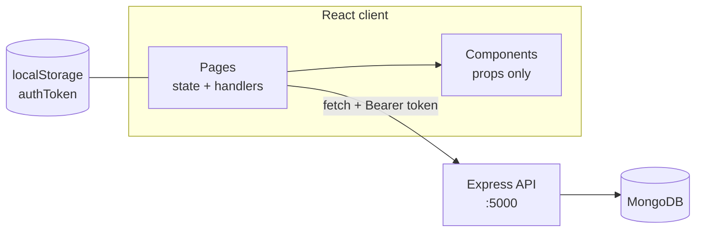

# App Architecture — The Whole Picture

A map of the React client: what exists, how it's organized, and what technology powers each part.

## Tech stack

| Layer             | Technology                     | Role                                                |
| ----------------- | ------------------------------ | --------------------------------------------------- |
| Build tool        | **Vite**                       | Dev server with hot reload, production bundling     |
| UI library        | **React 19**                   | Components, state, rendering                        |
| Routing           | **react-router-dom**           | Client-side pages (`Routes`, `Link`, `useNavigate`) |
| Icons             | **react-icons**                | Material Design + Font Awesome icon components      |
| Loading UI        | **react-spinners**             | `ClipLoader` while fetching                         |
| HTTP              | **fetch** (built-in)           | All server communication                            |
| Session           | **localStorage**               | Auth token persistence (`authToken` key)            |
| Linting           | **oxlint**                     | `npm run lint`                                      |
| Backend (sibling) | Express + MongoDB on port 5000 | REST API — see the server docs                      |

## Routes

Defined in `src/App.jsx`, wrapped by `BrowserRouter` in `src/main.jsx`:

| Path        | Page     | Access                                                      |
| ----------- | -------- | ----------------------------------------------------------- |
| `/`         | Landing  | Public — welcome quote + links                              |
| `/Landing`  | Landing  | Same component, reachable after logout                      |
| `/Login`    | Login    | Public                                                      |
| `/Register` | Register | Public                                                      |
| `/Home`     | Home     | **Protected** — redirects to `/Login` without a valid token |

## Pages (`src/pages/`)

Each page is a folder with a `.jsx` + `.css` pair.

- **Landing** — static welcome screen, `Link`s to Login/Register.
- **Register** — controlled inputs (email, password, verify), local validation, POST `/users`, stores token, navigates to Home.
- **Login** — POST `/users/login`, stores token, navigates to Home; link to Register.
- **Home** — the app itself:
  - fetches tasks on mount (`useEffect` + GET `/tasks`)
  - add (POST), toggle (PATCH), delete (DELETE) — full CRUD
  - route protection (no token / 401 → redirect) and logout (→ `/Landing`)
  - `loading` spinner + `error` message states
  - completed tasks sorted to the bottom at render time

## Components (`src/components/`)

Reusable, presentational, state-free — state lives in the pages:

- **Input** — controlled `<input>` (`placeholder`, `value`, `onChange`, `type`).
- **Button** — styled `<button>` (`text`, `onClick`).
- **TextLarge** — styled label text (`text`).
- **TaskItem** — one `<li>` per task: description, done-toggle icon (`MdDone` / `MdDoneAll` ternary on `completed`), delete icon (`FaDeleteLeft`). Receives everything via props: `task`, `completed`, `onUpdate`, `onDelete`.

## Configuration

- **`src/config.js`** — exports `API_URL`: `VITE_API_URL` env var in production (e.g. Render), `http://localhost:5000` fallback locally. Every fetch composes URLs from it.

## Data flow (the shape of everything)

- **State lives in pages** (`useState`), flows _down_ into components as props; events flow _up_ via callback props (`onDelete`, `onUpdate`).
- **The server is the source of truth** — every mutation is persisted first, then mirrored into state with a new array (spread / `filter` / `map`), never mutation.
- **The token** is written by Register/Login, read by every protected fetch, removed by logout/401.

## Patterns used everywhere

1. **HTTP calls**: validate → send → parse → act, wrapped in try/catch (docs 04).
2. **Auth header**: `Authorization: Bearer <token>` on all `/tasks` calls (docs 06).
3. **Immutable state updates**: add = spread, delete = `filter`, update = `map` (docs 07).
4. **Conditional rendering**: ternary for either/or, `&&` for maybe (docs 08).
5. **Early `return` after errors and redirects** — code after a failure must not run.
